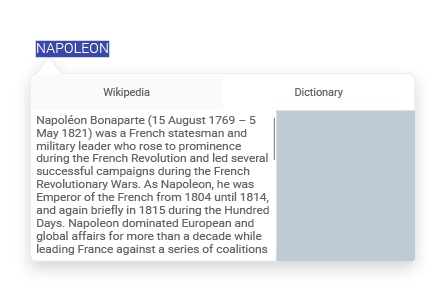
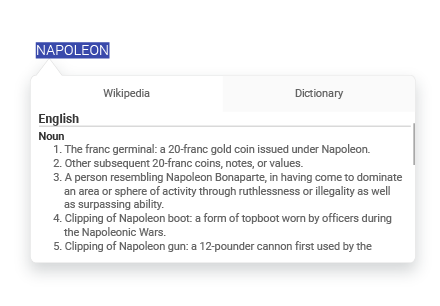

 

    
 

Welcome to my little project: [Wikilinks](https://chrome.google.com/webstore/detail/wikilink/dnjfeagdbicleejdgpjmjbbnfgdkdgpe) 🖖

The main goal is to be a handy chrome extension to fast and efficiently search terms on Wikipedia.

## The idea
What I always try to do is to simplify the life of everyone and, consequently, do everything in an efficient way, so when I saw that beautiful popup in a Wikipedia's article, I told myself that the entire web had to have that... so here I am trying to do that.

If you don't know what I'm talking about, just hover the pointer over some words in [this article](https://en.wikipedia.org/wiki/Albert_Einstein) about Albert Einstein.

## How it works
When the user selects a text, it will pass the paragraph through the Franc library and determine the language. After the language is determined, it will make a quick call to Wikipedia API with the selection and the language and return a list of articles results that will be shown in a popup below the selection.

    

 
After the user have selected an option (an article), it will be displayed there, too. If he wants to see the Wiktionary definitions, tha tab [Dictionary] can be clicked.

 

<!-- ## Under the hood -->
## Todo List
- [ ] Wl00 - Fix shortcut detection bug.
- [ ] Wl01 - Create a link to access the page of the Wikipedia's article.
- [x] Wl02 - Create a buttom for navigation between the article and the articles list.
- [ ] Wl03 - Black List sites.